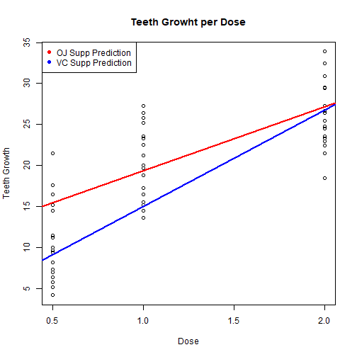

My App Presentation
========================================================
author: R3M79
date: 2018/03/11
autosize: true

Overview
========================================================

This presentation will show the app developed for predicting 
the Teeth Growth and is divided in the following way:

- Summary of the data used in the models
- Plot of Predictor Models
- Preview of created App

Dataset Summary
========================================================


```r
summary(ToothGrowth)
```

```
      len        supp         dose      
 Min.   : 4.20   OJ:30   Min.   :0.500  
 1st Qu.:13.07   VC:30   1st Qu.:0.500  
 Median :19.25           Median :1.000  
 Mean   :18.81           Mean   :1.167  
 3rd Qu.:25.27           3rd Qu.:2.000  
 Max.   :33.90           Max.   :2.000  
```

Models plotting
========================================================



Preview
========================================================

